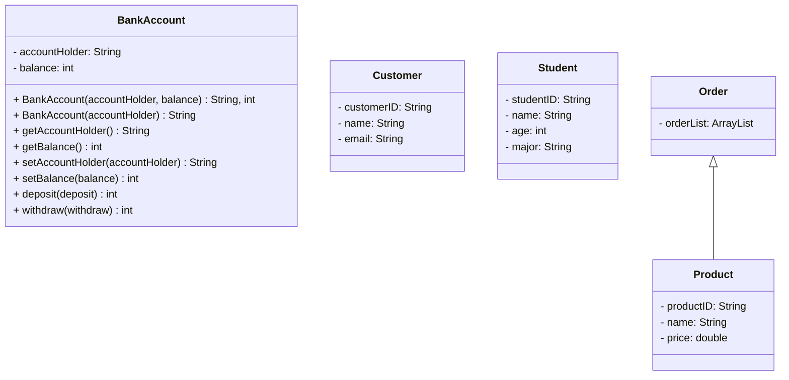

```mermaid
classDiagram
    class BankAccount {
        - accountHolder: String
        - balance: int
        + BankAccount(accountHolder, balance) String, int
        + BankAccount(accountHolder) String
        + getAccountHolder() String
        + getBalance() int
        + setAccountHolder(accountHolder) String
        + setBalance(balance) int
        + deposit(deposit) int
        + withdraw(withdraw) int
    }
    
    class Customer {
    	- customerID: String
    	- name: String
    	- email: String
    }
    
    class Student {
        - studentID: String
        - name: String
        - age: int
        - major: String
    }
    
    class Product {
        - productID: String
        - name: String
        - price: double
    }
    
    class Order {
        - orderList: ArrayList
    }
    
    Order <|-- Product
```